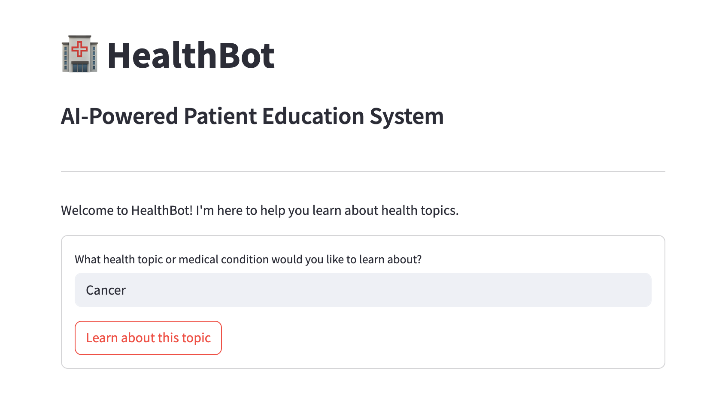
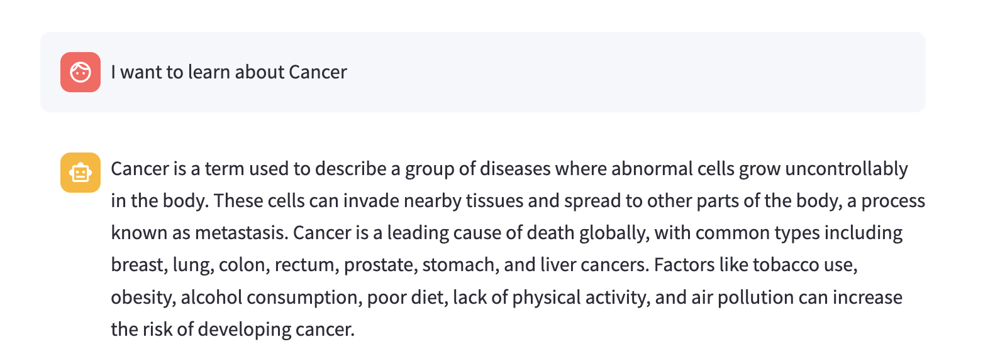
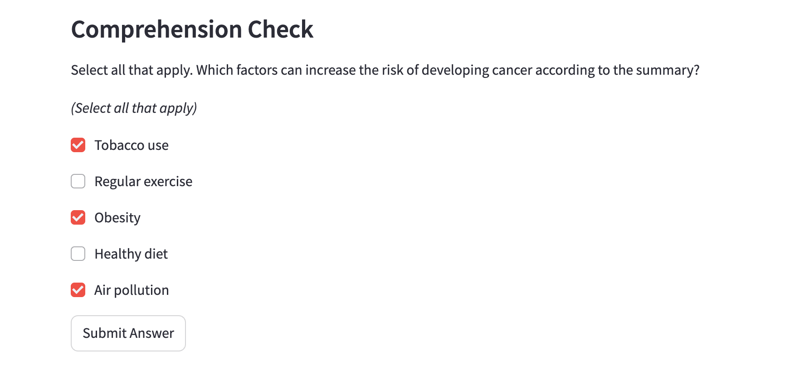
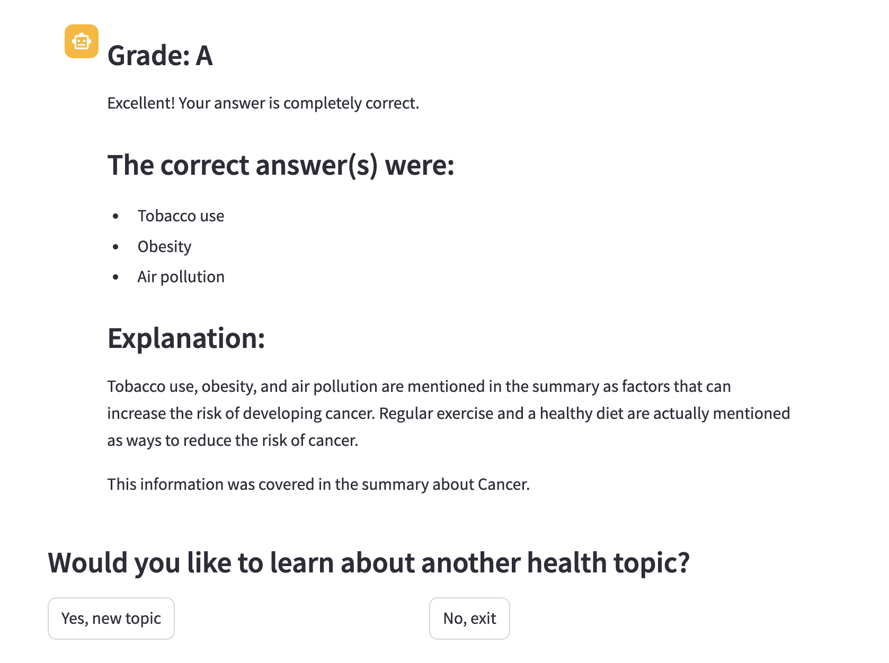

# HealthBot: AI-Powered Patient Education System

HealthBot is an Agentic-based healthcare assistant designed to provide reliable health information, explain medical concepts in simple language, and test users' understanding through interactive quizzes.

## Project Overview

HealthBot leverages the power of LangGraph, LangChain, and OpenAI's language models to create an interactive educational experience. The system:


1. Asks users what health topic they'd like to learn about
2. Searches for reliable information from trusted medical sources
3. Summarizes the information in patient-friendly language
4. Tests comprehension with targeted quiz questions
5. Provides personalized feedback with citations from the summary

## Features

<table>
  <tr>
    <td></td>
    <td></td>
    <td></td>
    <td></td>
  </tr>
</table>

- **Reliable Information**: Searches only reputable medical websites (Mayo Clinic, NIH, WHO, CDC, etc.)
- **Patient-Friendly Language**: Converts complex medical information into easy-to-understand summaries
- **Interactive Learning**: Tests comprehension with customized quiz questions
- **Personalized Feedback**: Provides detailed feedback with citations from the summary

## Project Structure

```
healthbot
├── src/                        # Source code directory
│   ├── __init__.py             # Makes src a Python package
│   ├── state.py                # Defines HealthBot state class
│   ├── tools.py                # Defines Tavily search tool
│   ├── models.py               # Initializes language models
│   ├── user_interface.py       # User interaction functions
│   ├── utils.py                # Utility functions
│   ├── nodes.py                # Workflow node definitions
│   └── workflow.py             # Workflow graph construction
├── main.py                     # Command-line interface
├── app.py                      # Streamlit web interface
└── README.md                   # Project documentation
```

## Installation

To run HealthBot, you'll need Python 3.11:

1. Clone the repository:
   ```bash
   git clone https://github.com/deepbiolab/healthbot.git
   cd healthbot
   ```

2. Install dependencies:
   ```bash
   pip install -r requirements.txt
   ```

3. Create a `.env` file in the project root with your API keys:
   ```
   OPENAI_API_KEY=your_openai_api_key
   TAVILY_API_KEY=your_tavily_api_key
   ```

## Usage

### Command Line Interface

Run HealthBot from the command line:

```bash
python main.py
```

This will start an interactive session where you can:
- Enter a health topic you'd like to learn about
- Read a patient-friendly summary
- Take a quiz to test your understanding
- Receive personalized feedback
- Choose to learn about another topic or exit

### Web Interface

Run HealthBot as a web application:

```bash
streamlit run app.py
```

This will launch a Streamlit web interface that provides the same functionality in a more user-friendly format.

## Contributing

Contributions are welcome! Please feel free to submit a Pull Request.

## License

This project is licensed under the MIT License - see the LICENSE file for details.